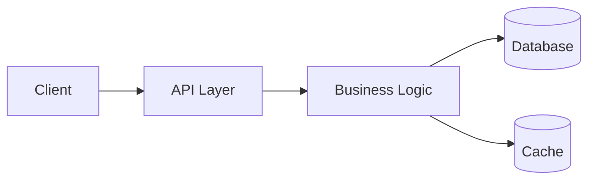

# SDD Document Templates

## spec.md Template

```markdown
# Spec: [Story Title] — [Story ID]

## User Story

**As a** [persona/role],
**I want** [capability/action],
**So that** [business outcome/value].

## Context

[1–3 sentences of background. Why does this story exist? What problem does it solve?]

## Acceptance Criteria

| ID | Criteria (EARS format) |
|----|------------------------|
| AC-1 | When [trigger], the system shall [response]. |
| AC-2 | If [condition], the system shall [response]. |
| AC-3 | The system shall [always-true requirement]. |

## Out of Scope

- [Explicitly excluded item 1]
- [Explicitly excluded item 2]

## Assumptions

- [Assumption that was made during refinement]

## Open Questions

| # | Question | Owner | Status |
|---|----------|-------|--------|
| 1 | [Question text] | [Name] | Open |

## Dependencies

- [Story ID / external system / team this story depends on]
```

---

## plan.md Template

```markdown
# Technical Plan: [Story Title] — [Story ID]

## High-Level Architecture

[Mermaid diagram or ASCII art showing components involved]



## Components Affected

| Component | Change Type | Notes |
|-----------|-------------|-------|
| [Service/Module] | New / Modified / Removed | [brief note] |

## Architecture Decision Records (ADRs)

### ADR-1: [Decision Title]
- **Context:** [Why a decision was needed]
- **Decision:** [What was decided]
- **Rationale:** [Why this option over alternatives]
- **Trade-offs:** [What we give up]

## Data Model Changes

### New / Modified Tables/Collections

```sql
-- Example: new table
CREATE TABLE orders (
  id UUID PRIMARY KEY,
  user_id UUID NOT NULL,
  status VARCHAR(50),
  created_at TIMESTAMPTZ DEFAULT NOW()
);
```

## API Contracts

### [Method] /path/to/endpoint

**Request:**
```json
{
  "field": "type"
}
```

**Response (200):**
```json
{
  "field": "type"
}
```

**Error Responses:**
- `400 Bad Request` — [when]
- `404 Not Found` — [when]
- `500 Internal Server Error` — [when]

## Security Considerations

- Auth: [Who can access this? Roles/permissions required]
- Sensitive data: [PII, payment info, etc. and how it's handled]
- Input validation: [What's validated and where]

## Performance Considerations

- Expected load: [requests/sec, data volume]
- Caching strategy: [what, where, TTL]
- Database: [indexes needed, query considerations]

## Observability

- Logs: [key log points]
- Metrics: [counters, timers to emit]
- Alerts: [thresholds to monitor]
```

---

## tasks.md Template

```markdown
# Tasks: [Story Title] — [Story ID]

## Summary

Total tasks: X | Estimated effort: X story points

## Layer: Database / Data Model

### TASK-001: [Task Title]
**Layer:** Database
**Size:** S / M / L
**Depends on:** none
**Description:** [What to implement, 2–3 sentences]
**Inputs:** [What the dev needs — schema, existing code ref, etc.]
**Output / Done when:** [Verifiable completion criteria]

---

## Layer: Backend / Business Logic

### TASK-002: [Task Title]
**Layer:** Backend
**Size:** S / M / L
**Depends on:** TASK-001
**Description:** [What to implement]
**Inputs:** [What the dev needs]
**Output / Done when:** [Verifiable completion criteria]

---

## Layer: API

### TASK-003: [Task Title]
**Layer:** API
**Size:** S / M / L
**Depends on:** TASK-002
**Description:** [What to implement]
**Inputs:** [What the dev needs]
**Output / Done when:** [Verifiable completion criteria]

---

## Layer: Frontend / UI

### TASK-004: [Task Title]
**Layer:** Frontend
**Size:** S / M / L
**Depends on:** TASK-003
**Description:** [What to implement]
**Inputs:** [API contract from plan.md, design mockups if available]
**Output / Done when:** [Verifiable completion criteria]

---

## Layer: Testing

### TASK-005: Unit Tests — [Component]
**Layer:** Testing
**Size:** S
**Depends on:** TASK-002
**Description:** Unit tests for [component]. Cover happy path, edge cases, and error paths.
**Output / Done when:** Test coverage ≥ 80%, all tests pass in CI.

### TASK-006: Integration Tests — [Flow]
**Layer:** Testing
**Size:** M
**Depends on:** TASK-003, TASK-004
**Description:** Integration tests for [end-to-end flow].
**Output / Done when:** All AC-X criteria automated and passing.

---

## Task Dependency Map

```
TASK-001 → TASK-002 → TASK-003 → TASK-004
                ↓                    ↓
           TASK-005            TASK-006
```
```