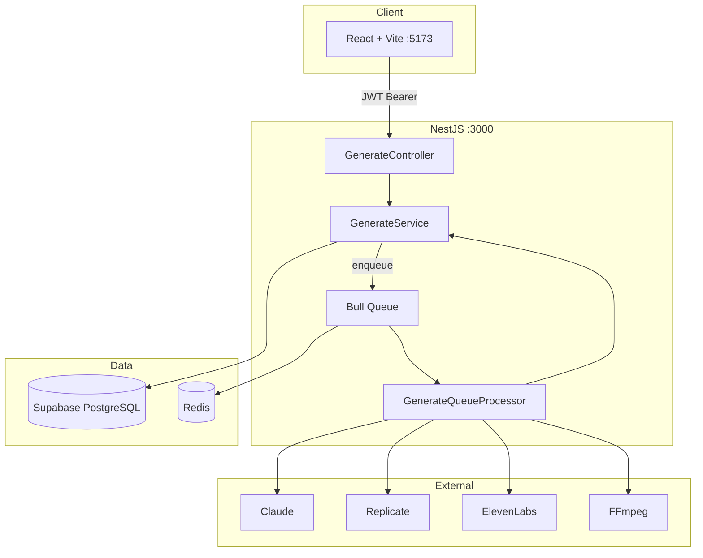

# StoryForge Backend Architecture

**Version:** 1.0 (MVP) · **Updated:** 19 May 2026

---

## System overview



---

## Async queue pattern

Every generation endpoint follows the same flow:

1. Client calls `POST /generate/{type}` with JWT.
2. `GenerateService` creates a `Job` row (`status: pending`).
3. Job payload is added to Bull queue `generation`.
4. Server responds **immediately** with `jobId` and `202 Accepted`.
5. `GenerateQueueProcessor` picks up the job, sets `processing`, runs business logic.
6. On success: `status: completed`, `result` JSON stored in DB.
7. On failure: `status: failed`, `error` message stored; up to 3 retries configured on Job model.
8. Client polls `GET /generate/job/:jobId` for progress and result.

This pattern is implemented in:

- `backend/src/generate/generate.service.ts` — enqueue + helpers
- `backend/src/generate/generate.queue.processor.ts` — `@Processor('generation')`
- `backend/src/common/queue/queue.service.ts` — Bull wrapper

---

## Module structure

```text
backend/src/
├── main.ts                 # Bootstrap, Swagger, queue init
├── app.module.ts           # ThrottlerGuard (global), imports
├── generate/
│   ├── generate.controller.ts
│   ├── generate.service.ts
│   ├── generate.queue.processor.ts
│   ├── generate.module.ts
│   └── dto/
├── integrations/
│   ├── replicate.service.ts
│   ├── elevenlabs.service.ts
│   └── video.service.ts      # FFmpeg wrapper
└── common/
    ├── prisma/               # PostgreSQL via Prisma
    ├── queue/                # Bull + Redis
    ├── auth/                 # JWT (Supabase token validation)
    └── supabase/
```

---

## Database models (Prisma)

| Model | Purpose |
|-------|---------|
| `User` | Auth user, monthly quota |
| `Project` | Story container (optional link to jobs) |
| `Job` | Async generation unit — **core of API** |
| `Output` | Final assets (URLs in Supabase Storage) |
| `Event` | Analytics events (optional) |

**Job** fields used by the API:

- `type`: `script` \| `images` \| `audio` \| `video`
- `status`: `pending` \| `processing` \| `completed` \| `failed`
- `progress`: 0–100
- `result`: JSON string (parsed on GET job)
- `userId`: enforced on status reads

Schema: `backend/prisma/schema.prisma`

---

## External integrations

| Service | SDK / tool | Used for | Env variable |
|---------|------------|----------|--------------|
| Claude 3.5 Sonnet | `@anthropic-ai/sdk` | Script generation | `ANTHROPIC_API_KEY` |
| Replicate (Flux) | `replicate` npm | Image generation | `REPLICATE_API_TOKEN` |
| ElevenLabs | HTTP (Fetch) | Text-to-speech | `ELEVENLABS_API_KEY` |
| FFmpeg | System binary | Video assembly | `VIDEO_OUTPUT_DIR` |

### Cost awareness (approximate)

| API | Rough cost | Throttle |
|-----|------------|----------|
| Claude | ~$0.10/request | 5/min |
| Replicate | ~$0.01/image | 10/min |
| ElevenLabs | ~$0.01/min audio | 15/min |
| FFmpeg | Local CPU | 10/min |

---

## Security layers

1. **JWT** — `JwtAuthGuard` on all generate routes; validated via Supabase.
2. **Throttling** — `ThrottlerGuard` registered globally in `app.module.ts`; per-route `@Throttle()` overrides.
3. **User isolation** — `getJobStatus()` verifies `job.userId === request user`.
4. **Input validation** — `class-validator` DTOs + global `ValidationPipe`.

---

## Frontend (Week 3+)

| Item | Status |
|------|--------|
| Location | `/frontend` |
| Stack | React 18, Vite 5, Tailwind, shadcn/ui |
| Port | 5173 |
| Integration | Not wired to backend yet — next phase |

---

## Technical debt (known)

- Video files written to local disk (`VIDEO_OUTPUT_DIR`), not Supabase Storage yet.
- Job polling only (no WebSockets/SSE).
- E2E tests deferred to staging (Task 6.6).
- `projectId` on jobs is optional — projects not fully used in MVP flow.

---

**See also:** [API_ENDPOINTS.md](API_ENDPOINTS.md) · [STACK_INIT.md](STACK_INIT.md) · [instructions/TASK_2_3_PLAN.md](instructions/TASK_2_3_PLAN.md)
