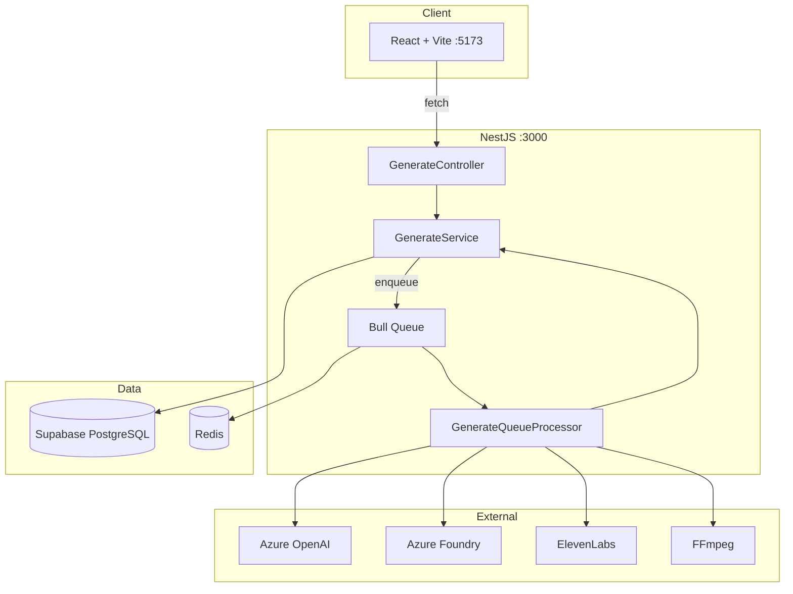

# StoryForge -- Architecture & Tech Stack

## System Overview



## Async Queue Pattern

Every generation endpoint follows the same flow:

1. Client calls `POST /generate/{type}`
2. `GenerateService` creates a `Job` row (`status: pending`)
3. Job payload is added to Bull queue `generation`
4. Server responds immediately with `jobId` and `202 Accepted`
5. `GenerateQueueProcessor` picks up the job, sets `processing`, runs business logic
6. On success: `status: completed`, `result` JSON stored in DB
7. On failure: `status: failed`, `error` stored; up to 3 retries (exponential backoff)
8. Client polls `GET /generate/job/:jobId` every 3s for progress and result

## Database Models (Prisma)

| Model | Purpose | Status |
|-------|---------|--------|
| `User` | Auth user, monthly quota | Used (upsert on auth) |
| `Project` | Story container | Schema only (no CRUD endpoint) |
| `Job` | Async generation unit | Fully used (core of API) |
| `Output` | Final assets | Schema only (no endpoint) |
| `Event` | Analytics events | Schema only (not integrated) |

**Job** fields: `type` (script/images/audio/video), `status` (pending/processing/completed/failed), `progress` (0-100), `result` (JSON), `userId`, `retriesLeft`

Schema: `backend/prisma/schema.prisma`

## API Endpoints

| Method | Path | Throttle | Purpose |
|--------|------|----------|---------|
| POST | /generate/script | 5/min | Script generation |
| POST | /generate/images | 10/min | Image generation |
| POST | /generate/audio | 15/min | Audio narration |
| POST | /generate/video | 10/min | Video assembly |
| GET | /generate/job/:jobId | -- | Job status polling |

Swagger docs: `http://localhost:3000/api`

## Security

1. **JWT** -- `JwtAuthGuard` on generate routes (Supabase token validation)
2. **Throttling** -- `ThrottlerGuard` global + per-route `@Throttle()` overrides
3. **User isolation** -- `getJobStatus()` verifies `job.userId === request user`
4. **Input validation** -- `class-validator` DTOs + global `ValidationPipe`

Note: Auth guard exists but controllers currently use hardcoded `dev-user`. No login/signup routes implemented yet.

## External Integrations

| Service | Package | Purpose |
|---------|---------|---------|
| Azure OpenAI | `@azure/openai` v1.0.0-beta.13 | Script generation (getChatCompletions) |
| Azure Foundry | `@azure/openai` | Image generation (Flux.2, 1024x1024) |
| ElevenLabs | Native fetch | Text-to-speech (base64 audio) |
| FFmpeg | System binary (child_process) | Video assembly (1080x1920) |
| Supabase | `@supabase/supabase-js` | Storage (video upload + signed URLs) |

Dev mode: Azure OpenAI falls back to mock script if API call fails.

## Environment Variables (actually used in code)

### Backend

```env
# Required
SUPABASE_URL=https://xxxxx.supabase.co
SUPABASE_SERVICE_ROLE_KEY=xxxxx
SUPABASE_JWT_SECRET=xxxxx
REDIS_URL=redis://localhost:6379
AZURE_OPENAI_ENDPOINT=xxxxx
AZURE_OPENAI_API_KEY=xxxxx
AZURE_OPENAI_API_VERSION=xxxxx
AZURE_OPENAI_DEPLOYMENT_GPT41=xxxxx

# Optional
PORT=3000
CORS_ORIGIN=http://localhost:5173
NODE_ENV=development
LOG_LEVEL=info
VIDEO_OUTPUT_DIR=./tmp/videos
VIDEO_ASSEMBLY_STRATEGY=local
MODAL_FUNCTION_URL=xxxxx
SENTRY_DSN=xxxxx
JWT_SECRET=xxxxx
```

Note: `DATABASE_URL` is used by Prisma internally (not referenced in app code but required in .env).

### Frontend

```env
VITE_API_URL=http://localhost:3000
```

Note: `VITE_SUPABASE_URL` and `VITE_SUPABASE_ANON_KEY` are in .env.example but not used in code.

## Authorized Tech Stack

### Frontend
React 18.3, Vite 5, TailwindCSS 3, shadcn/ui, TypeScript 5, React Router 6, Lucide icons, Vitest + RTL

Installed but unused: `@supabase/supabase-js`, `axios`, `zustand`

### Backend
NestJS 10, TypeScript 5, Prisma, `@azure/openai`, `@supabase/supabase-js`, Bull + ioredis, `@nestjs/throttler`, `@nestjs/jwt` + passport-jwt, Swagger, Sentry, class-validator, Winston

Not installed despite env vars in .env.example: `anthropic`, `replicate`

## Deploy

No Docker, CI/CD, or Render config files exist. Deployment is manual via Render dashboard.

| Target | Build | Start |
|--------|-------|-------|
| Backend | `cd backend && npm install && npm run build` | `npm run start:prod` |
| Frontend | `cd frontend && npm install && npm run build` | Static serve from `dist/` |
