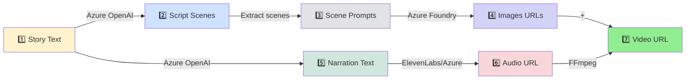
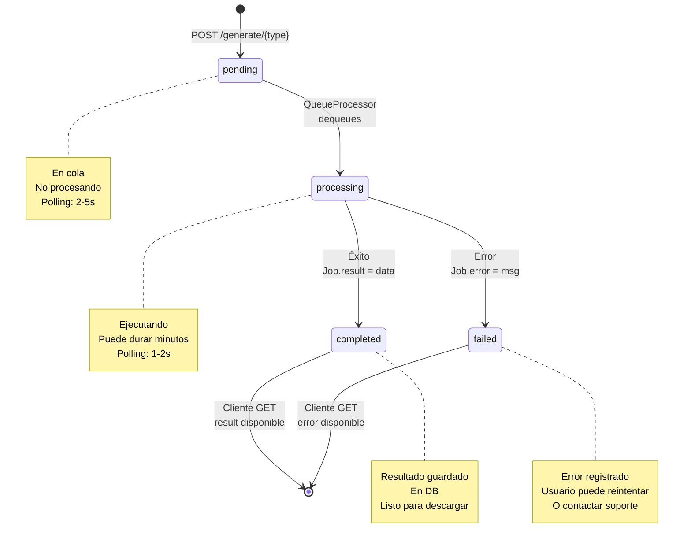

# Diagrama de Arquitectura - StoryForge

## Arquitectura General del Sistema

```mermaid
graph TB
    subgraph "Cliente"
        Browser["🌐 Browser"]
        React["⚛️ React SPA (localhost:5173)"]
        Auth["🔐 Auth Context"]
        Fetch["fetch + JWT"]
    end

    subgraph "Servidor API"
        NestJS["🔴 NestJS (localhost:3000)"]
        Routes["Routes"]
        GenerateCtrl["GenerateController"]
        GenerateService["GenerateService"]
        AuthCtrl["AuthController"]
        AuthGuard["JwtAuthGuard"]
    end

    subgraph "Persistencia"
        Postgres["🐘 PostgreSQL<br/>Supabase"]
        Redis["🔴 Redis"]
    end

    subgraph "Procesamiento Asincrónico"
        BullQueue["📦 Bull Queue<br/>Redis-backed"]
        QueueProcessor["⚙️ Queue Processor"]
        Workers["Worker Pool"]
    end

    subgraph "Servicios Externos"
        OpenAI["🧠 Azure OpenAI<br/>GPT-4 Turbo"]
        Foundry["🎨 Azure Foundry<br/>Flux.2-pro"]
        ElevenLabs["🎤 ElevenLabs TTS"]
        AzureSpeech["🔊 Azure Speech<br/>Fallback TTS"]
        FFmpeg["🎬 FFmpeg<br/>Video Assembly"]
    end

    subgraph "Almacenamiento"
        Storage["☁️ Supabase Storage<br/>Bucket: /videos, /images, /audio"]
    end

    Browser -->|HTTPS| React
    React -->|fetch + JWT| NestJS
    
    React -->|auth/login| AuthCtrl
    AuthCtrl -->|bcrypt | GenerateService
    AuthCtrl -->|JWT sign| Fetch

    React -->|POST /generate/script| GenerateCtrl
    React -->|GET /generate/job/:id| GenerateCtrl
    
    GenerateCtrl -->|AuthGuard(JWT)| AuthGuard
    GenerateCtrl -->|Service| GenerateService
    
    GenerateService -->|Create Job| Postgres
    GenerateService -->|Fetch Job| Postgres
    GenerateService -->|Add to Queue| BullQueue
    
    BullQueue -->|persistence| Redis
    BullQueue -->|dequeue + process| QueueProcessor
    QueueProcessor -->|Update Job| Postgres
    
    QueueProcessor -->|generateScript()| OpenAI
    QueueProcessor -->|generateImage()| Foundry
    QueueProcessor -->|generateTTS()| ElevenLabs
    ElevenLabs -->|fallback| AzureSpeech
    QueueProcessor -->|assembleVideo()| FFmpeg
    
    OpenAI -->|completion| QueueProcessor
    Foundry -->|image URL| QueueProcessor
    ElevenLabs -->|audio URL| QueueProcessor
    AzureSpeech -->|audio URL| QueueProcessor
    FFmpeg -->|video file| QueueProcessor
    
    QueueProcessor -->|Upload| Storage
    QueueProcessor -->|Save result URL| Postgres
    
    Postgres -->|read/write| NestJS
    
    style Browser fill:#e3f2fd
    style React fill:#fff3e0
    style NestJS fill:#ffebee
    style Postgres fill:#f3e5f5
    style Redis fill:#fce4ec
    style BullQueue fill:#e8f5e9
    style QueueProcessor fill:#e0f2f1
    style OpenAI fill:#fff9c4
    style Foundry fill:#f1f8e9
    style ElevenLabs fill:#fbe9e7
    style Storage fill:#eceff1
```

---

## Flujo de Datos: Script → Video



---

## Capas del Backend

```
┌─────────────────────────────────────┐
│     API Controllers Layer           │
│  ├─ GenerateController              │
│  ├─ AuthController                  │
│  └─ ...other routes                 │
├─────────────────────────────────────┤
│     Guards & Middleware             │
│  ├─ JwtAuthGuard (auth)             │
│  ├─ ThrottleGuard (rate limiting)   │
│  └─ RequestLogger                   │
├─────────────────────────────────────┤
│     Service Layer                   │
│  ├─ GenerateService (orquestación)  │
│  ├─ AuthService (JWT, bcrypt)       │
│  └─ PrismaService (DB abstraction)  │
├─────────────────────────────────────┤
│     Integration Layer               │
│  ├─ AzureOpenAIService              │
│  ├─ ImageService (Foundry)          │
│  ├─ AudioGenerationService (TTS)    │
│  ├─ VideoService (FFmpeg)           │
│  ├─ VoiceCatalogService             │
│  └─ ElevenLabsService (directo)     │
├─────────────────────────────────────┤
│     Queue Layer                     │
│  ├─ QueueService (Bull enqueue)     │
│  ├─ QueueProcessor (worker)         │
│  └─ Redis (queue storage)           │
├─────────────────────────────────────┤
│     Data Layer                      │
│  ├─ PrismaClient                    │
│  ├─ Supabase PostgreSQL             │
│  └─ Redis (caching)                 │
└─────────────────────────────────────┘
```

---

## Job Status Flow Diagram



---

## Dependencias Entre Jobs

```
┌──────────────────┐
│   SCRIPT Job     │  (Entrada: story text)
│  result: script  │
└────────┬─────────┘
         │
         ├───────────────────────────────────┐
         │                                   │
         v                                   v
    ┌─────────────────┐            ┌──────────────────┐
    │  IMAGES Job     │            │   AUDIO Job      │
    │ scriptId: ref   │            │ scriptId: ref    │
    │ imageUrls: []   │            │ audioUrl: "..."  │
    │ style: enum     │            │ audioLength: num │
    └────────┬────────┘            └────────┬─────────┘
             │                              │
             │      (ambos completados)    │
             └──────────────┬───────────────┘
                            │
                            v
                    ┌──────────────────┐
                    │   VIDEO Job      │
                    │ imageJobId: ref  │
                    │ audioJobId: ref  │
                    │ videoUrl: "..."  │
                    └──────────────────┘
                            │
                            v
                    ┌──────────────────┐
                    │ ✓ Video Completo │
                    │ (descargable)    │
                    └──────────────────┘
```

---

## Integración con Servicios Externos

### Azure OpenAI (Script + Narration)
```
Backend
  └─ POST /chat/completions
     ├─ Endpoint: AZURE_OPENAI_ENDPOINT
     ├─ API-Key: AZURE_OPENAI_API_KEY
     ├─ Version: AZURE_OPENAI_API_VERSION
     ├─ Deployment: AZURE_OPENAI_DEPLOYMENT_GPT41
     └─ Modelo: GPT-4 Turbo
        ├─ generateScript() → "Scene 1: ..., Scene 2: ..."
        └─ generateAudioNarration() → "In a distant galaxy..."
```

### Azure Foundry (Image Generation)
```
Backend
  └─ POST /api/images/generate
     ├─ Endpoint: Foundry project
     ├─ Auth: API Key
     ├─ Modelo: Flux.2-pro
     └─ Input: text prompt
        └─ Output: image URLs (Supabase Storage)
```

### ElevenLabs (TTS Primario)
```
Backend
  └─ POST /v1/text-to-speech/{voice_id}
     ├─ Endpoint: api.elevenlabs.io
     ├─ Auth: API Key
     ├─ Voice: 29+ idiomas
     └─ Output: audio mp3 (Supabase Storage)
```

### Azure Speech Services (Fallback TTS)
```
Backend
  └─ Tata Cloud TTS
     ├─ Si ElevenLabs falla
     ├─ Idiomas soportados: 90+
     └─ Output: audio (Supabase Storage)
```

### FFmpeg (Video Assembly)
```
Backend
  └─ Child Process
     ├─ Input: [image files] + [audio.mp3]
     ├─ Operación: concat + sync
     │  ├─ Imagen per escena
     │  ├─ Duración = audio length
     │  ├─ FPS: 30 (default)
     │  └─ Bitrate: 2M (default)
     └─ Output: video.mp4 → Supabase Storage
```

---

## Escalabilidad

### Horizontal Scaling

```
Load Balancer
  ├─ API 1 (NestJS)
  ├─ API 2 (NestJS)
  └─ API 3 (NestJS)
  
  (todos usan mismo)
  ├─ PostgreSQL (Supabase) - replicación
  ├─ Redis (Elasticache) - cluster
  └─ Bull Queue (Redis-backed)

Workers
  ├─ Worker 1 (independiente)
  ├─ Worker 2 (independiente)
  ├─ Worker 3 (independiente)
  └─ Worker N
  
  (procesan jobs en paralelo desde Redis)
```

### Bottlenecks

1. **Rate Limits Externos** (principal)
   - Azure OpenAI: ~10 req/min
   - Azure Foundry: ~5 req/min
   - ElevenLabs: variable por plan
   
2. **Redis Queue Throughput**
   - Bull: ~1000 jobs/sec
   - Normalmente no es bottleneck

3. **Storage (Supabase)**
   - Unlimited por plan
   - Bandwidth: variable

### Mitigation Strategies

```
┌─ Rate Limiting (NestJS Throttle decorator)
├─ Queue Retry Logic (exponential backoff)
├─ Service Health Checks
├─ Fallback Providers (Azure Speech)
├─ Job Timeout Handling
└─ Circuit Breaker Pattern (próximo)
```
