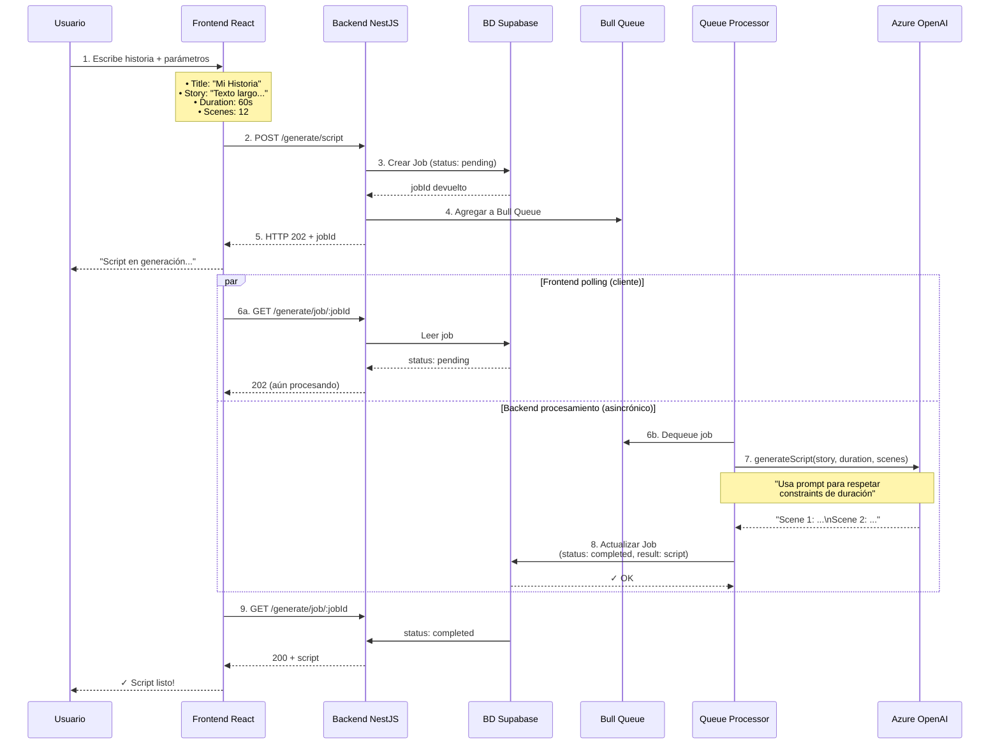
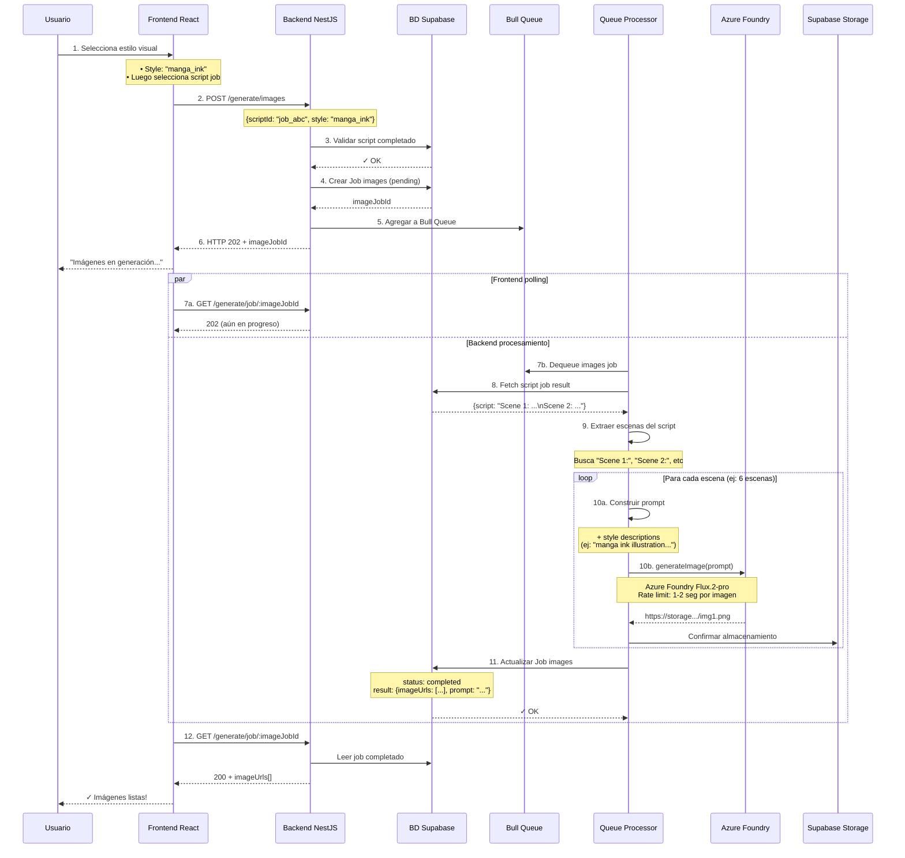
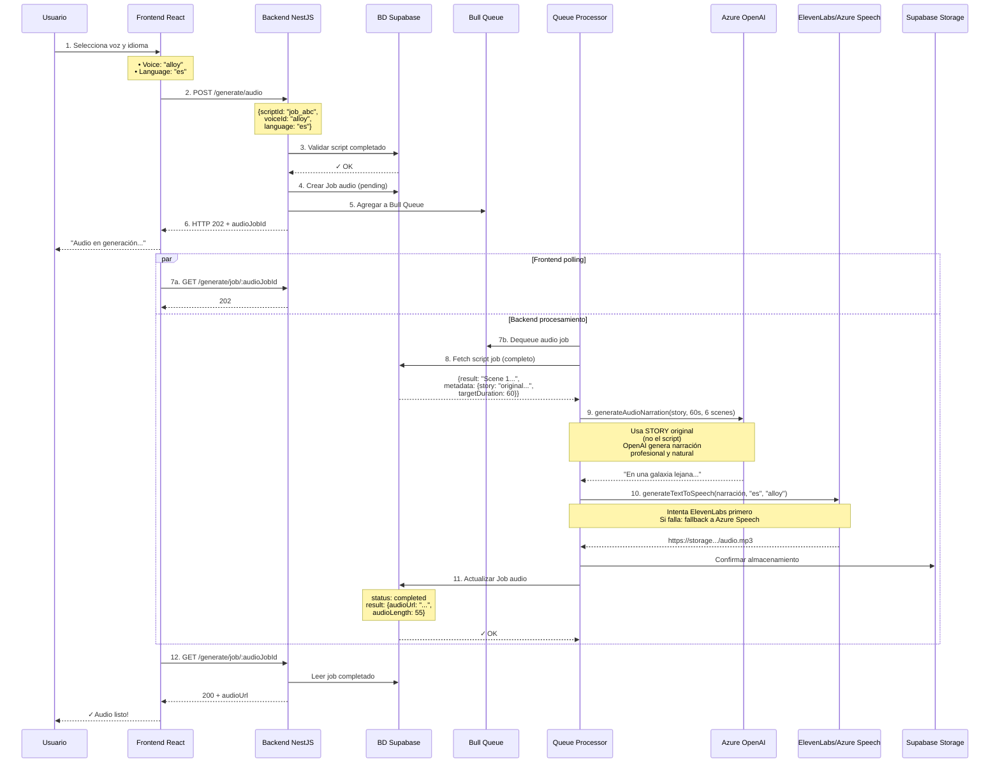
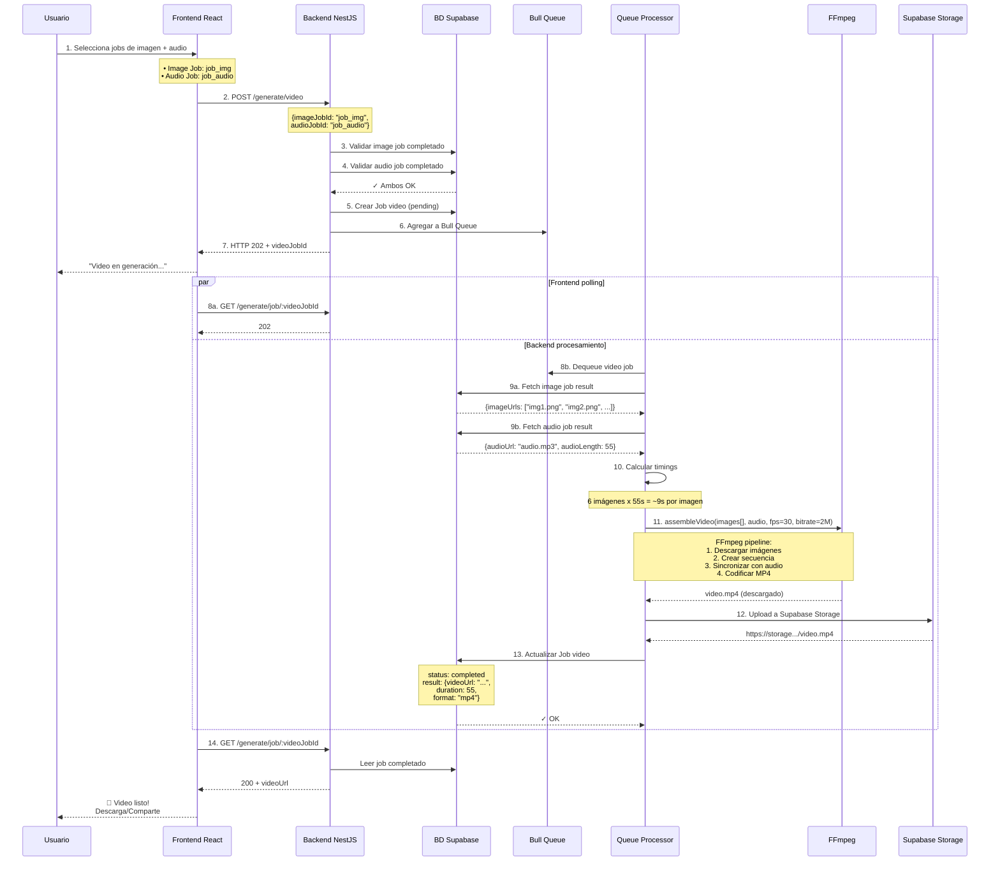
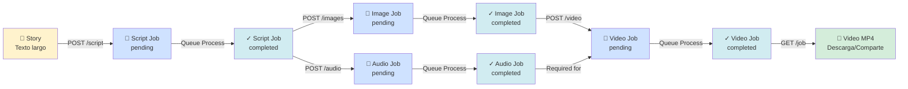

# Diagrama Secuencial - StoryForge

Flujo paso a paso de cómo se genera un video completo desde una historia.

## Resumen Rápido

```
Usuario envía historia
    ↓
[1] POST /script → Job pending → Azure OpenAI → script con escenas
    ↓
[2] POST /images → Job pending → Azure Foundry → imágenes de cada escena
    ↓
[3] POST /audio → Job pending → OpenAI + ElevenLabs → narración de audio
    ↓
[4] POST /video → Job pending → FFmpeg → video final
    ↓
Video completado ✓
```

---

## Paso 1: Generar Script

Convierte una historia larga en un script con escenas cortas.



**Salida:** Job con `result = {script: "Scene 1: ..., Scene 2: ..."}`

---

## Paso 2: Generar Imágenes

Extrae escenas del script y genera una imagen por escena.



**Salida:** Job con `result = {imageUrls: ["url1", "url2", ...], prompt: "..."}`

---

## Paso 3: Generar Audio

Genera una narración profesional y la convierte a audio.



**Salida:** Job con `result = {audioUrl: "https://...", audioLength: 55}`

---

## Paso 4: Ensamblar Video

Combina imágenes + audio en un video MP4 final.



**Salida:** Job con `result = {videoUrl: "https://...", duration: 55, format: "mp4"}`

---

## Patrón General: Fire & Poll

Todos los pasos siguen este patrón:

```
1. POST /generate/{type}
   ├─ BD: Job creado (pending)
   ├─ Queue: Job encolado
   └─ API: Devuelve 202 + jobId

2. GET /generate/job/:jobId (polling)
   ├─ Si status=pending: Devuelve 202
   ├─ Si status=completed: Devuelve 200 + resultado
   └─ Si status=failed: Devuelve 200 + error

[En background: Queue Processor procesa asincronamente]
```

**Ventajas:**
- ✓ Frontend no bloquea esperando
- ✓ Tolera servicios externos lentos
- ✓ Escalable: múltiples jobs simultáneos
- ✓ Tolerancia a fallos: reintentos automáticos

---

## Flujo Completo: Visión General


